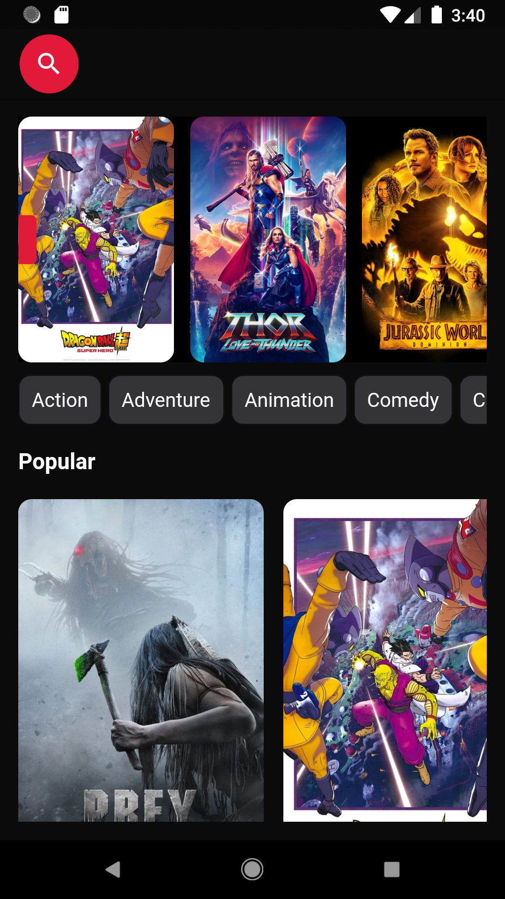
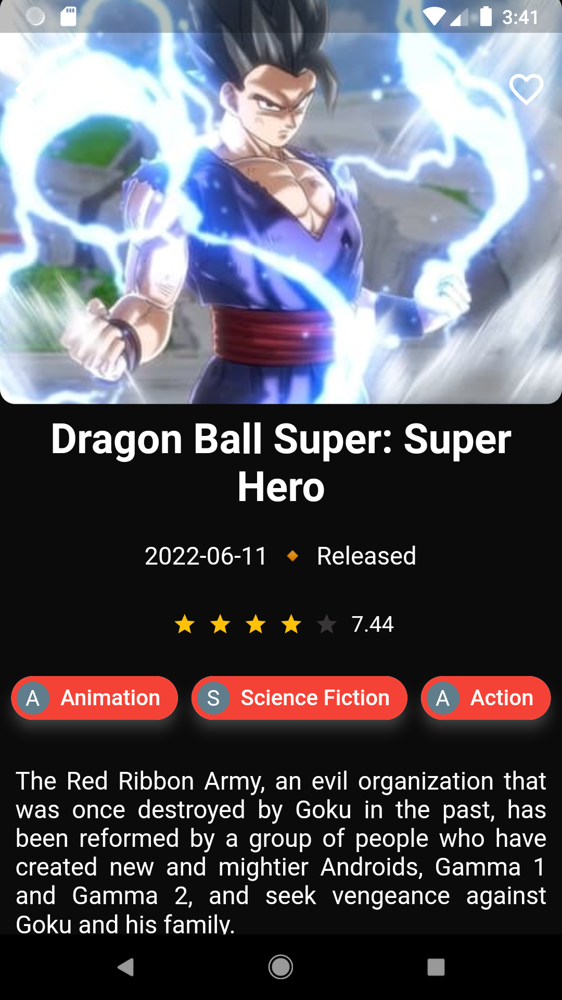
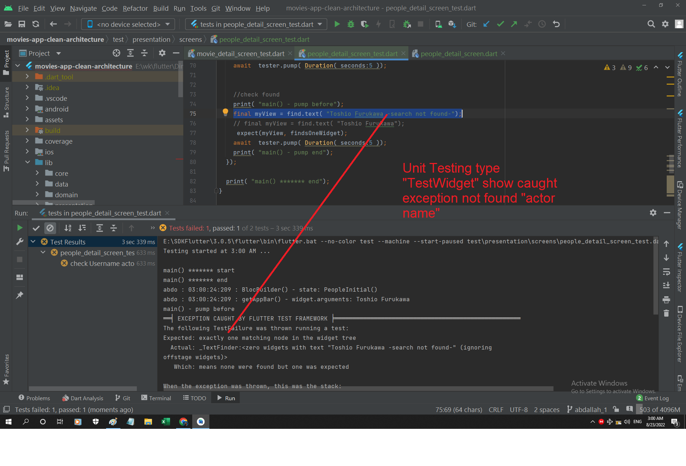
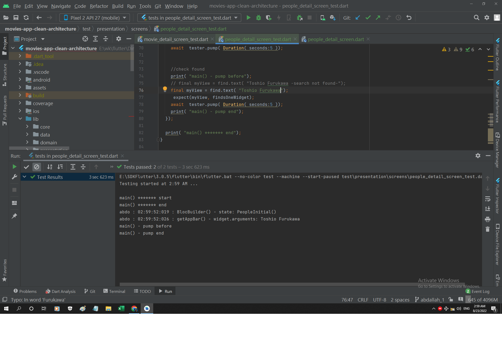

# Fork by Abdallah Mahmoud 
* Fix Home Page api 
* Fix Move Detail Page not showing Cast Actors 
* Create Page "Actor Images" 
* Create Unit Testing for "TestWidget" for "Check UserName of Actor found at Page "Actor Images"

## Screenshot of Pages  

  
  
  
  
 

## Screenshot of TestWidget Unit Testing Result

  
  
 

